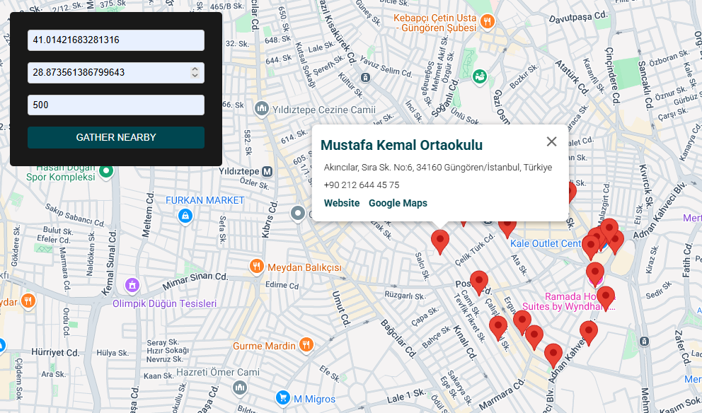

# 🌍 Codexist Nearby Places App

This project is a case study built for Codexist. It’s a full-stack web application that allows users to search for nearby places by providing geographical coordinates. It integrates Google Places API for location data and displays results interactively on a map.

## 🚀 Live Demo (Uses free tier render, so it can be unavailable)

- **Frontend:** [https://codexist-frontend.onrender.com](https://codexist-frontend.onrender.com)
- **Backend:** [https://codexist-backend-kwqy.onrender.com](https://codexist-backend-kwqy.onrender.com)

---

## 🛠️ Tech Stack

### Backend
- Java 17
- Spring Boot 3
- Spring Data JPA (Hibernate)
- PostgreSQL (via Render)
- REST Client for Google Places API

### Frontend
- React
- TypeScript
- Vite
- @vis.gl/react-google-maps

---

## 📸 Screenshot
- 
- 
---

## 📁 Setup
- Make sure you have Docker installed on your machine. Then configure the environment variables on compose.yaml file.
- Then you can directly call the command `docker-compose up --build` which will set up everything for you.
- In case it not work you may need to build java yourself. Build with `mvn clean package -DskipTest` and `docker-compose up --build` again.

